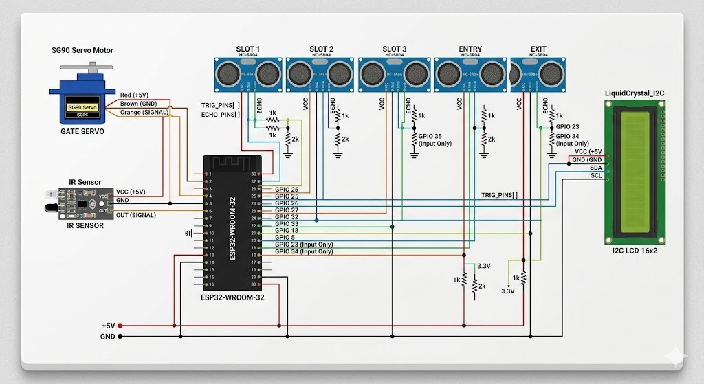
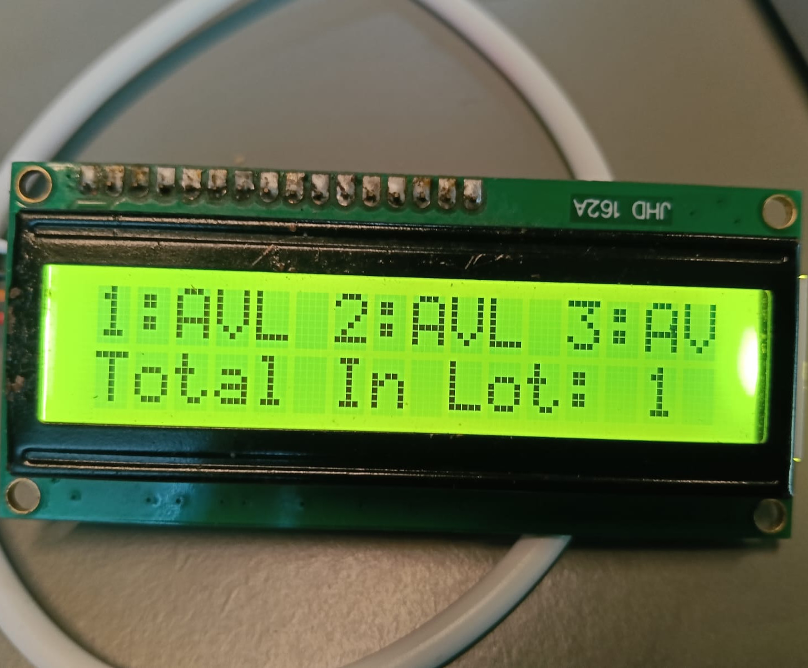

<div align="center">

<h1>🅿️ SmartPark</h1>

<p><strong>Real-time smart parking — from hardware to your pocket.</strong></p>

[](https://flutter.dev)
[](https://fastapi.tiangolo.com)
[](https://firebase.google.com)
[](https://www.espressif.com)
[](LICENSE)

</div>

---

## 🗺️ Project Overview

**SmartPark** solves the everyday frustration of not knowing where a free parking spot is — before you even enter the lot.

A network of **ESP32-powered sensor nodes** monitors each parking slot in real time using ultrasonic distance sensors and IR-based gate detection. When a vehicle enters or leaves, the hardware instantly pushes an update to **Firebase Realtime Database**. A lightweight **FastAPI server** reads this data and exposes clean REST endpoints. The **Flutter mobile app** polls those endpoints on a short timer and renders a live dashboard showing exactly how many slots are free, which slots are occupied, and the overall availability rate — all updated within seconds.

### Key highlights
- 🚗 **Zero guesswork** — drivers see real-time slot counts before parking
- 🔒 **Safe environment** — DHT11 + MQ-2 sensors monitor temperature & gas levels
- 🌐 **Fully wireless** — ESP32 connects over Wi-Fi; no wiring to a central server
- 📱 **Cross-platform app** — runs on Android, iOS, and Web from a single codebase
- ⚡ **Lightweight stack** — FastAPI + Firebase keeps the backend lean and fast

---

## ✨ System Architecture

SmartPark connects physical hardware to a mobile dashboard through three tightly integrated layers:

```
ESP32 Sensors  ──▶  Firebase Realtime DB  ──▶  FastAPI Server  ──▶  Flutter App
```

| Layer | What it does | Location |
|---|---|---|
| 🔌 **Hardware** | Reads sensors, controls gate, sends telemetry | `Hardware/smaerparking/smartparking.ino` |
| ⚡ **Backend** | Serves Firebase data via REST API | `server/main.py` |
| 📱 **App** | Live dashboard with auto-refresh | `smartpark/lib/main.dart` |

---

## 🚀 Quick Start

**Prerequisites:** Flutter SDK ≥ 3.10 · Python ≥ 3.10 · Firebase project · *(optional)* ESP32 toolchain

### 1 — Backend
```bash
cd server
python -m venv .venv && source .venv/bin/activate
pip install -r requirements.txt
uvicorn main:app --host 0.0.0.0 --port 8000 --reload
```
> Place your `firebase_credentials.json` in `server/` or export Firebase values as env vars.

### 2 — Flutter App
```bash
cd smartpark
flutter pub get
flutter run --dart-define=API_BASE_URL=http://<YOUR_LAN_IP>:8000
```

### 3 — ESP32 *(optional)*
Update Wi-Fi credentials and Firebase URL in the `.ino` sketch, then flash.

---

## 🛠 API Endpoints

| Method | Route | Description |
|---|---|---|
| `GET` | `/health` | Firebase connection status |
| `GET` | `/sensors` | All slot records *(paginated)* |
| `GET` | `/sensors/latest` | Newest slot record |
| `GET` | `/sensors/{id}` | Single slot lookup |
| `GET` | `/sensors/availability/summary` | Free / occupied counts |

---

## ⚙️ Hardware Capabilities

- **Ultrasonic** slot occupancy sensing
- **IR** gate trigger logic + **servo** barrier control
- **DHT11** temperature & **MQ-2** gas safety monitoring
- Firebase sync for real-time analytics

---

## 📸 Hardware Preview

| Circuit | LCD Output |
|:---:|:---:|
| [](Hardware/images/Circuit_image.jpeg) | [](Hardware/images/LCD_output.jpeg) |
| *Wiring & sensor layout* | *Live LCD status display* |

---

## 📝 Notes

- 🔒 Never commit `firebase_credentials.json` — it's already in `.gitignore`
- 📡 On Android devices, use your machine's **LAN IP**, not `localhost`
- 🗂 Firebase slot data lives under the `slots/` path in your Realtime DB

---

## 📄 License

Distributed under the **MIT License**. See [`LICENSE`](LICENSE) for details.